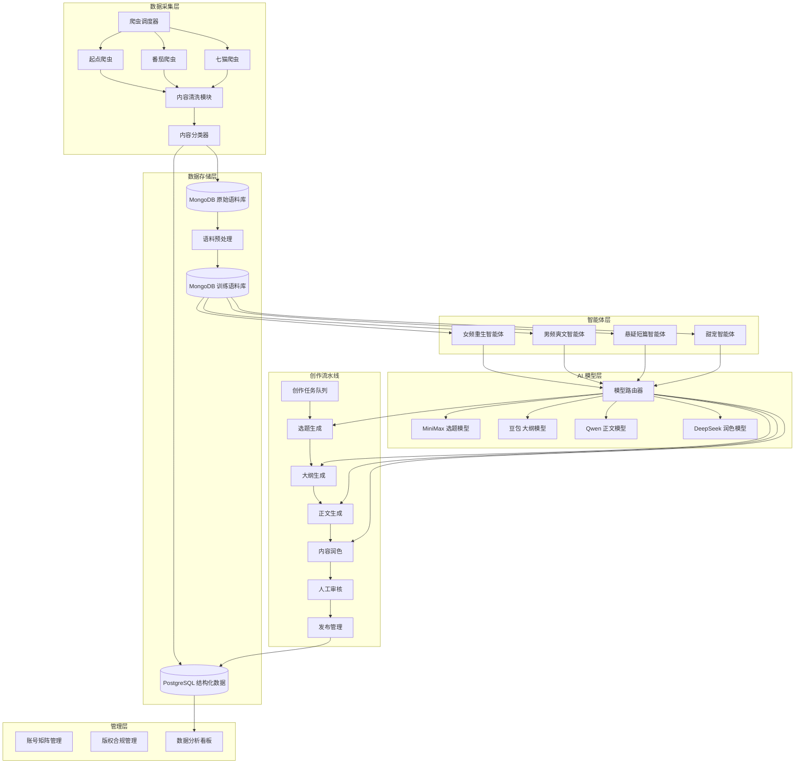

# 技术设计文档：AI小说矩阵工作室系统

## 概述

本系统是一个基于多模型协作的 AI 小说创作平台，通过爬虫系统采集优质语料，训练专项智能体，实现"语料→智能体→创作"的闭环。系统支持多账号矩阵管理、多模型分工协作、自动化创作流水线，旨在提升创作效率、保障内容质量、规避版权风险。

**核心技术特点**：
- 多模型分工协作（MiniMax/豆包/Qwen/DeepSeek 各司其职）
- 智能爬虫系统（自动采集、清洗、分类语料）
- 专项智能体（针对不同题材的定制化创作引擎）
- 完整数据流（爬虫→分类→语料库→智能体→创作流水线）
- 版权合规机制（创作痕迹留存、人工审核）

**技术栈**：
- 后端：Python 3.10+, FastAPI, Celery
- 数据库：PostgreSQL（关系型数据）, MongoDB（文档型数据）, Redis（缓存/队列）
- 爬虫：Scrapy, Playwright（反爬处理）
- AI 模型：MiniMax API, 豆包 API, Qwen API, DeepSeek API
- 部署：Docker, Nginx, Supervisor

---

## 系统架构

### 整体架构图



### 核心模块说明

1. **数据采集层**：负责从目标网站爬取免费小说内容，进行清洗和分类
2. **数据存储层**：存储原始语料、训练语料和结构化数据
3. **AI 模型层**：多模型协作，根据创作环节分配不同模型
4. **智能体层**：针对不同题材的专项智能体，注入对应语料
5. **创作流水线**：自动化创作流程，从选题到发布
6. **管理层**：账号管理、版权管理、数据分析

---

## 核心模块设计

### 1. 多模型分工配置

#### 1.1 模型选型与分工

根据各模型特点，分配到不同创作环节：

| 模型 | 核心优势 | 分配环节 | API 接入方式 | 成本估算 |
|------|---------|---------|-------------|---------|
| **MiniMax** | 创意生成、热点分析 | 选题生成、灵感激发 | REST API (HTTPS) | ¥0.01/千tokens |
| **豆包 (Doubao)** | 中文理解、逻辑严谨 | 大纲生成、结构设计 | REST API (HTTPS) | ¥0.008/千tokens |
| **Qwen (通义千问)** | 长文本生成、网文风格 | 正文生成、细节填充 | REST API (HTTPS) | ¥0.006/千tokens |
| **DeepSeek** | 语言润色、风格优化 | 内容润色、去 AI 味 | REST API (HTTPS) | ¥0.001/千tokens |

#### 1.2 模型配置数据结构

```python
from enum import Enum
from pydantic import BaseModel, Field
from typing import Dict, Optional

class ModelProvider(str, Enum):
    """模型提供商枚举"""
    MINIMAX = "minimax"
    DOUBAO = "doubao"
    QWEN = "qwen"
    DEEPSEEK = "deepseek"

class CreationStage(str, Enum):
    """创作环节枚举"""
    TOPIC_GENERATION = "topic_generation"
    OUTLINE_GENERATION = "outline_generation"
    CONTENT_GENERATION = "content_generation"
    POLISH = "polish"

class ModelConfig(BaseModel):
    """模型配置"""
    provider: ModelProvider
    api_key: str
    api_endpoint: str
    model_name: str
    max_tokens: int = Field(default=4096, description="最大生成长度")
    temperature: float = Field(default=0.7, ge=0.0, le=2.0, description="生成温度")
    top_p: float = Field(default=0.9, ge=0.0, le=1.0, description="核采样参数")
    timeout: int = Field(default=60, description="请求超时时间（秒）")
    retry_times: int = Field(default=3, description="失败重试次数")
    
class ModelRouter(BaseModel):
    """模型路由配置"""
    stage_model_mapping: Dict[CreationStage, ModelProvider] = {
        CreationStage.TOPIC_GENERATION: ModelProvider.MINIMAX,
        CreationStage.OUTLINE_GENERATION: ModelProvider.DOUBAO,
        CreationStage.CONTENT_GENERATION: ModelProvider.QWEN,
        CreationStage.POLISH: ModelProvider.DEEPSEEK,
    }
    model_configs: Dict[ModelProvider, ModelConfig]
    fallback_model: Optional[ModelProvider] = ModelProvider.QWEN
```

#### 1.3 模型调用接口

```python
import httpx
import asyncio
from typing import List, Dict, Any
from abc import ABC, abstractmethod

class BaseModelClient(ABC):
    """模型客户端基类"""
    
    def __init__(self, config: ModelConfig):
        self.config = config
        self.client = httpx.AsyncClient(timeout=config.timeout)
    
    @abstractmethod
    async def generate(self, prompt: str, system_prompt: str = "", **kwargs) -> str:
        """生成内容"""
        pass
    
    async def generate_with_retry(self, prompt: str, system_prompt: str = "", **kwargs) -> str:
        """带重试的生成"""
        for attempt in range(self.config.retry_times):
            try:
                return await self.generate(prompt, system_prompt, **kwargs)
            except Exception as e:
                if attempt == self.config.retry_times - 1:
                    raise
                await asyncio.sleep(2 ** attempt)  # 指数退避
    
    async def close(self):
        await self.client.aclose()

class MiniMaxClient(BaseModelClient):
    """MiniMax 模型客户端"""
    
    async def generate(self, prompt: str, system_prompt: str = "", **kwargs) -> str:
        headers = {
            "Authorization": f"Bearer {self.config.api_key}",
            "Content-Type": "application/json"
        }
        payload = {
            "model": self.config.model_name,
            "messages": [
                {"role": "system", "content": system_prompt},
                {"role": "user", "content": prompt}
            ],
            "temperature": kwargs.get("temperature", self.config.temperature),
            "max_tokens": kwargs.get("max_tokens", self.config.max_tokens),
        }
        response = await self.client.post(
            self.config.api_endpoint,
            headers=headers,
            json=payload
        )
        response.raise_for_status()
        data = response.json()
        return data["choices"][0]["message"]["content"]

class DoubaoClient(BaseModelClient):
    """豆包模型客户端"""
    
    async def generate(self, prompt: str, system_prompt: str = "", **kwargs) -> str:
        # 豆包 API 调用实现（类似 MiniMax）
        headers = {
            "Authorization": f"Bearer {self.config.api_key}",
            "Content-Type": "application/json"
        }
        payload = {
            "model": self.config.model_name,
            "messages": [
                {"role": "system", "content": system_prompt},
                {"role": "user", "content": prompt}
            ],
            "temperature": kwargs.get("temperature", self.config.temperature),
            "max_tokens": kwargs.get("max_tokens", self.config.max_tokens),
        }
        response = await self.client.post(
            self.config.api_endpoint,
            headers=headers,
            json=payload
        )
        response.raise_for_status()
        data = response.json()
        return data["choices"][0]["message"]["content"]

class QwenClient(BaseModelClient):
    """Qwen 模型客户端"""
    
    async def generate(self, prompt: str, system_prompt: str = "", **kwargs) -> str:
        # Qwen API 调用实现
        headers = {
            "Authorization": f"Bearer {self.config.api_key}",
            "Content-Type": "application/json"
        }
        payload = {
            "model": self.config.model_name,
            "input": {
                "messages": [
                    {"role": "system", "content": system_prompt},
                    {"role": "user", "content": prompt}
                ]
            },
            "parameters": {
                "temperature": kwargs.get("temperature", self.config.temperature),
                "max_tokens": kwargs.get("max_tokens", self.config.max_tokens),
            }
        }
        response = await self.client.post(
            self.config.api_endpoint,
            headers=headers,
            json=payload
        )
        response.raise_for_status()
        data = response.json()
        return data["output"]["text"]

class DeepSeekClient(BaseModelClient):
    """DeepSeek 模型客户端"""
    
    async def generate(self, prompt: str, system_prompt: str = "", **kwargs) -> str:
        # DeepSeek API 调用实现
        headers = {
            "Authorization": f"Bearer {self.config.api_key}",
            "Content-Type": "application/json"
        }
        payload = {
            "model": self.config.model_name,
            "messages": [
                {"role": "system", "content": system_prompt},
                {"role": "user", "content": prompt}
            ],
            "temperature": kwargs.get("temperature", self.config.temperature),
            "max_tokens": kwargs.get("max_tokens", self.config.max_tokens),
        }
        response = await self.client.post(
            self.config.api_endpoint,
            headers=headers,
            json=payload
        )
        response.raise_for_status()
        data = response.json()
        return data["choices"][0]["message"]["content"]

class ModelClientFactory:
    """模型客户端工厂"""
    
    _clients = {
        ModelProvider.MINIMAX: MiniMaxClient,
        ModelProvider.DOUBAO: DoubaoClient,
        ModelProvider.QWEN: QwenClient,
        ModelProvider.DEEPSEEK: DeepSeekClient,
    }
    
    @classmethod
    def create(cls, provider: ModelProvider, config: ModelConfig) -> BaseModelClient:
        client_class = cls._clients.get(provider)
        if not client_class:
            raise ValueError(f"Unsupported model provider: {provider}")
        return client_class(config)
```

---

### 2. 爬虫系统设计

#### 2.1 目标网站与爬取策略

| 网站 | 目标内容 | 爬取频率 | 反爬策略 | 优先级 |
|------|---------|---------|---------|--------|
| **起点中文网** | 免费章节（前 50 章） | 每日 1 次 | User-Agent 轮换、IP 代理池 | 高 |
| **番茄小说** | 免费完结短篇 | 每日 2 次 | Cookie 池、请求延迟 | 高 |
| **七猫小说** | 免费热门章节 | 每日 1 次 | Playwright 模拟浏览器 | 中 |
| **知乎盐选** | 公开短篇故事 | 每周 2 次 | 登录态维护、请求限流 | 中 |

#### 2.2 爬虫架构设计

```python
from scrapy import Spider, Request
from scrapy.crawler import CrawlerProcess
from playwright.async_api import async_playwright
from typing import List, Dict, Optional
from datetime import datetime
import hashlib

class NovelSpider(Spider):
    """小说爬虫基类"""
    
    name = "novel_spider"
    
    def __init__(self, target_site: str, *args, **kwargs):
        super().__init__(*args, **kwargs)
        self.target_site = target_site
        self.user_agents = [
            "Mozilla/5.0 (Windows NT 10.0; Win64; x64) AppleWebKit/537.36",
            "Mozilla/5.0 (Macintosh; Intel Mac OS X 10_15_7) AppleWebKit/537.36",
            # 更多 User-Agent
        ]
    
    def start_requests(self):
        """生成初始请求"""
        urls = self.get_target_urls()
        for url in urls:
            yield Request(
                url=url,
                callback=self.parse,
                headers=self.get_random_headers(),
                meta={"download_delay": 2}  # 请求延迟
            )
    
    def get_random_headers(self) -> Dict[str, str]:
        """获取随机请求头"""
        import random
        return {
            "User-Agent": random.choice(self.user_agents),
            "Accept": "text/html,application/xhtml+xml",
            "Accept-Language": "zh-CN,zh;q=0.9",
        }
    
    def get_target_urls(self) -> List[str]:
        """获取目标 URL 列表（子类实现）"""
        raise NotImplementedError
    
    def parse(self, response):
        """解析响应（子类实现）"""
        raise NotImplementedError

class QidianSpider(NovelSpider):
    """起点中文网爬虫"""
    
    name = "qidian_spider"
    
    def get_target_urls(self) -> List[str]:
        # 从数据库或配置文件读取目标书籍 URL
        return [
            "https://www.qidian.com/book/1234567",
            "https://www.qidian.com/book/7654321",
        ]
    
    def parse(self, response):
        """解析书籍页面"""
        book_info = {
            "title": response.css("h1.book-title::text").get(),
            "author": response.css("a.author-name::text").get(),
            "category": response.css("span.category::text").get(),
            "intro": response.css("div.book-intro::text").get(),
        }
        
        # 获取章节列表
        chapter_urls = response.css("ul.chapter-list a::attr(href)").getall()[:50]
        
        for chapter_url in chapter_urls:
            yield Request(
                url=response.urljoin(chapter_url),
                callback=self.parse_chapter,
                meta={"book_info": book_info}
            )
    
    def parse_chapter(self, response):
        """解析章节内容"""
        book_info = response.meta["book_info"]
        chapter_data = {
            "book_title": book_info["title"],
            "book_author": book_info["author"],
            "book_category": book_info["category"],
            "chapter_title": response.css("h3.chapter-title::text").get(),
            "chapter_content": "\n".join(response.css("div.chapter-content p::text").getall()),
            "crawl_time": datetime.utcnow(),
            "source_url": response.url,
            "content_hash": self.calculate_hash(response.css("div.chapter-content").get()),
        }
        yield chapter_data
    
    @staticmethod
    def calculate_hash(content: str) -> str:
        """计算内容哈希（用于去重）"""
        return hashlib.md5(content.encode()).hexdigest()

class FanqieSpider(NovelSpider):
    """番茄小说爬虫（使用 Playwright 处理动态加载）"""
    
    name = "fanqie_spider"
    
    async def parse_with_playwright(self, url: str) -> Dict:
        """使用 Playwright 解析动态页面"""
        async with async_playwright() as p:
            browser = await p.chromium.launch(headless=True)
            context = await browser.new_context(
                user_agent=self.get_random_headers()["User-Agent"]
            )
            page = await context.new_page()
            
            await page.goto(url, wait_until="networkidle")
            await page.wait_for_selector("div.chapter-content")
            
            content = await page.inner_text("div.chapter-content")
            title = await page.inner_text("h1.chapter-title")
            
            await browser.close()
            
            return {
                "chapter_title": title,
                "chapter_content": content,
                "source_url": url,
                "crawl_time": datetime.utcnow(),
            }
```

#### 2.3 内容清洗模块

```python
import re
from typing import Dict, Optional
from bs4 import BeautifulSoup

class ContentCleaner:
    """内容清洗器"""
    
    @staticmethod
    def clean_html(html_content: str) -> str:
        """清洗 HTML 标签"""
        soup = BeautifulSoup(html_content, "html.parser")
        return soup.get_text(separator="\n", strip=True)
    
    @staticmethod
    def remove_ads(content: str) -> str:
        """移除广告内容"""
        ad_patterns = [
            r"本章未完.*?点击下一页继续阅读",
            r"更多精彩小说.*?请访问",
            r"关注公众号.*?领取福利",
            r"下载.*?APP.*?阅读全文",
        ]
        for pattern in ad_patterns:
            content = re.sub(pattern, "", content, flags=re.IGNORECASE)
        return content
    
    @staticmethod
    def normalize_whitespace(content: str) -> str:
        """规范化空白字符"""
        content = re.sub(r"\s+", " ", content)  # 多个空白字符合并为一个
        content = re.sub(r"\n\s*\n", "\n\n", content)  # 规范化段落间距
        return content.strip()
    
    @staticmethod
    def remove_special_chars(content: str) -> str:
        """移除特殊字符"""
        # 保留中文、英文、数字、常用标点
        content = re.sub(r"[^\u4e00-\u9fa5a-zA-Z0-9，。！？；：""''（）《》、\n ]", "", content)
        return content
    
    @classmethod
    def clean(cls, raw_content: str) -> str:
        """完整清洗流程"""
        content = cls.clean_html(raw_content)
        content = cls.remove_ads(content)
        content = cls.normalize_whitespace(content)
        content = cls.remove_special_chars(content)
        return content
    
    @staticmethod
    def validate_content(content: str, min_length: int = 500) -> bool:
        """验证内容有效性"""
        if len(content) < min_length:
            return False
        # 检查是否包含足够的中文字符
        chinese_chars = re.findall(r"[\u4e00-\u9fa5]", content)
        if len(chinese_chars) < min_length * 0.7:
            return False
        return True
```

#### 2.4 内容分类器

```python
from enum import Enum
from typing import List, Dict
import jieba
from sklearn.feature_extraction.text import TfidfVectorizer
from sklearn.naive_bayes import MultinomialNB
import pickle

class NovelCategory(str, Enum):
    """小说分类枚举"""
    FEMALE_REBIRTH = "female_rebirth"  # 女频重生
    MALE_POWER = "male_power"  # 男频爽文
    SUSPENSE = "suspense"  # 悬疑短篇
    ROMANCE = "romance"  # 甜宠

class ContentClassifier:
    """内容分类器"""
    
    def __init__(self):
        self.vectorizer = TfidfVectorizer(
            tokenizer=lambda x: jieba.lcut(x),
            max_features=5000
        )
        self.classifier = MultinomialNB()
        self.is_trained = False
    
    def train(self, texts: List[str], labels: List[NovelCategory]):
        """训练分类器"""
        X = self.vectorizer.fit_transform(texts)
        self.classifier.fit(X, labels)
        self.is_trained = True
    
    def predict(self, text: str) -> NovelCategory:
        """预测分类"""
        if not self.is_trained:
            raise ValueError("Classifier not trained")
        X = self.vectorizer.transform([text])
        prediction = self.classifier.predict(X)[0]
        return NovelCategory(prediction)
    
    def predict_proba(self, text: str) -> Dict[NovelCategory, float]:
        """预测各分类概率"""
        if not self.is_trained:
            raise ValueError("Classifier not trained")
        X = self.vectorizer.transform([text])
        probas = self.classifier.predict_proba(X)[0]
        return {
            category: float(proba)
            for category, proba in zip(self.classifier.classes_, probas)
        }
    
    def save(self, filepath: str):
        """保存模型"""
        with open(filepath, "wb") as f:
            pickle.dump({
                "vectorizer": self.vectorizer,
                "classifier": self.classifier,
            }, f)
    
    def load(self, filepath: str):
        """加载模型"""
        with open(filepath, "rb") as f:
            data = pickle.load(f)
            self.vectorizer = data["vectorizer"]
            self.classifier = data["classifier"]
            self.is_trained = True

class KeywordBasedClassifier:
    """基于关键词的分类器（作为补充）"""
    
    CATEGORY_KEYWORDS = {
        NovelCategory.FEMALE_REBIRTH: [
            "重生", "穿越", "虐渣", "马甲", "大佬", "打脸", "豪门", "霸总"
        ],
        NovelCategory.MALE_POWER: [
            "都市", "异能", "修仙", "系统", "签到", "无敌", "爽文", "龙王"
        ],
        NovelCategory.SUSPENSE: [
            "悬疑", "推理", "侦探", "凶手", "真相", "反转", "密室", "诡异"
        ],
        NovelCategory.ROMANCE: [
            "甜宠", "恋爱", "暖文", "治愈", "校园", "青梅竹马", "霸道总裁", "小娇妻"
        ],
    }
    
    @classmethod
    def classify(cls, text: str) -> NovelCategory:
        """基于关键词分类"""
        scores = {category: 0 for category in NovelCategory}
        
        for category, keywords in cls.CATEGORY_KEYWORDS.items():
            for keyword in keywords:
                scores[category] += text.count(keyword)
        
        return max(scores, key=scores.get)
```


---

### 3. 专项智能体设计

#### 3.1 智能体架构

每个智能体绑定一个题材分类，持有该题材的专属语料上下文、系统提示词和模型路由配置，对外暴露统一的创作接口。

```python
from dataclasses import dataclass, field
from typing import List, Optional
from enum import Enum

class AgentType(str, Enum):
    FEMALE_REBIRTH = "female_rebirth"   # 女频重生
    MALE_POWER     = "male_power"       # 男频爽文
    SUSPENSE       = "suspense"         # 悬疑短篇
    ROMANCE        = "romance"          # 甜宠

@dataclass
class AgentCorpus:
    """智能体语料上下文"""
    category: AgentType
    sample_titles: List[str]        # 同类爆款书名
    style_samples: List[str]        # 风格示例段落（从语料库抽取）
    hot_keywords: List[str]         # 高频爽点关键词
    forbidden_patterns: List[str]   # 禁止出现的 AI 套话

@dataclass
class NovelAgent:
    """专项创作智能体"""
    agent_type: AgentType
    corpus: AgentCorpus
    model_router: "ModelRouter"
    system_prompt_template: str     # 含 {corpus_samples} 占位符

    def build_system_prompt(self) -> str:
        samples = "\n---\n".join(self.corpus.style_samples[:5])
        return self.system_prompt_template.format(
            corpus_samples=samples,
            hot_keywords="、".join(self.corpus.hot_keywords),
        )

    async def generate_topic(self, trend_data: str) -> str:
        client = self.model_router.get_client_for_stage("topic_generation")
        return await client.generate_with_retry(
            prompt=f"热榜数据：{trend_data}\n请生成3个差异化选题，每个含书名、核心人设、爽点方向。",
            system_prompt=self.build_system_prompt(),
        )

    async def generate_outline(self, topic: str) -> str:
        client = self.model_router.get_client_for_stage("outline_generation")
        return await client.generate_with_retry(
            prompt=f"选题：{topic}\n请生成分卷大纲（5卷），每卷含3个核心爽点和结尾钩子。",
            system_prompt=self.build_system_prompt(),
        )

    async def generate_chapter(self, chapter_outline: str, prev_context: str = "") -> str:
        client = self.model_router.get_client_for_stage("content_generation")
        prompt = (
            f"上文摘要：{prev_context}\n"
            f"本章大纲：{chapter_outline}\n"
            "请按大纲生成本章正文（1500-2000字），保持人设一致，结尾留钩子。"
        )
        return await client.generate_with_retry(
            prompt=prompt,
            system_prompt=self.build_system_prompt(),
        )

    async def polish_content(self, raw_content: str) -> str:
        client = self.model_router.get_client_for_stage("polish")
        return await client.generate_with_retry(
            prompt=f"原文：\n{raw_content}\n\n请润色：去除AI套话、优化节奏、强化情绪张力，保留原意。",
            system_prompt="你是资深网文编辑，擅长去除AI生硬感，让文字更有人味。",
        )
```

#### 3.2 各智能体系统提示词模板

| 智能体 | 核心人设 | 写作风格要求 | 主力模型 |
|--------|---------|------------|---------|
| 女频重生 | 重生大佬、虐渣打脸、马甲揭秘 | 节奏快、爽点密、情绪张力强 | Qwen（正文）+ 豆包（大纲） |
| 男频爽文 | 系统流、签到流、都市无敌 | 升级感强、金手指清晰、爽点直给 | Qwen（正文）+ MiniMax（选题） |
| 悬疑短篇 | 推理反转、密室诡计、真相揭露 | 逻辑严密、伏笔精准、结尾反转 | DeepSeek（润色）+ 豆包（大纲） |
| 甜宠短篇 | 霸总追妻、校园初恋、青梅竹马 | 甜度高、节奏轻快、对话俏皮 | Qwen（正文）+ DeepSeek（润色） |

#### 3.3 语料注入流程

```
语料库(MongoDB)
    │
    ▼
CorpusLoader.load_for_agent(agent_type, limit=200)
    │  按分类拉取最新高质量语料
    ▼
StyleSampler.sample(corpus, n=5)
    │  随机抽取风格示例段落（避免固化）
    ▼
AgentCorpus(style_samples, hot_keywords, ...)
    │
    ▼
NovelAgent.build_system_prompt()
    │  将语料嵌入 system prompt
    ▼
模型 API 调用
```

---

### 4. 创作流水线设计

#### 4.1 任务状态机

```
PENDING → TOPIC_GENERATING → OUTLINE_GENERATING → CONTENT_GENERATING
       → POLISHING → HUMAN_REVIEW → PUBLISHING → DONE
                                  ↘ REJECTED → PENDING（重新排队）
```

#### 4.2 流水线编排

```python
from celery import Celery, chain
from celery.utils.log import get_task_logger

app = Celery("novel_pipeline", broker="redis://localhost:6379/0")
logger = get_task_logger(__name__)

@app.task(bind=True, max_retries=3)
def task_generate_topic(self, task_id: str, agent_type: str, trend_data: str):
    """选题生成任务"""
    try:
        agent = AgentRegistry.get(agent_type)
        topic = agent.generate_topic(trend_data)          # 调用智能体
        TaskStore.update(task_id, stage="outline", topic=topic)
        return {"task_id": task_id, "topic": topic}
    except Exception as exc:
        raise self.retry(exc=exc, countdown=60)

@app.task(bind=True, max_retries=3)
def task_generate_outline(self, prev_result: dict):
    task_id = prev_result["task_id"]
    topic   = prev_result["topic"]
    task    = TaskStore.get(task_id)
    agent   = AgentRegistry.get(task.agent_type)
    outline = agent.generate_outline(topic)
    TaskStore.update(task_id, stage="content", outline=outline)
    return {"task_id": task_id, "outline": outline}

@app.task(bind=True, max_retries=3)
def task_generate_chapters(self, prev_result: dict):
    task_id = prev_result["task_id"]
    task    = TaskStore.get(task_id)
    agent   = AgentRegistry.get(task.agent_type)
    chapters = []
    for i, chapter_outline in enumerate(task.outline_chapters):
        prev_ctx = chapters[-1][:300] if chapters else ""
        chapter  = agent.generate_chapter(chapter_outline, prev_ctx)
        chapters.append(chapter)
    TaskStore.update(task_id, stage="polish", chapters=chapters)
    return {"task_id": task_id, "chapters": chapters}

@app.task(bind=True, max_retries=3)
def task_polish(self, prev_result: dict):
    task_id  = prev_result["task_id"]
    task     = TaskStore.get(task_id)
    agent    = AgentRegistry.get(task.agent_type)
    polished = [agent.polish_content(ch) for ch in task.chapters]
    TaskStore.update(task_id, stage="human_review", polished=polished)
    return {"task_id": task_id}

def start_creation_pipeline(task_id: str, agent_type: str, trend_data: str):
    """启动完整创作流水线"""
    pipeline = chain(
        task_generate_topic.s(task_id, agent_type, trend_data),
        task_generate_outline.s(),
        task_generate_chapters.s(),
        task_polish.s(),
    )
    pipeline.apply_async()
```

#### 4.3 人工审核接口

```python
from fastapi import FastAPI, HTTPException
from pydantic import BaseModel

api = FastAPI()

class ReviewDecision(BaseModel):
    task_id: str
    approved: bool
    comments: str = ""

@api.post("/review/decide")
async def decide_review(decision: ReviewDecision):
    task = TaskStore.get(decision.task_id)
    if not task:
        raise HTTPException(status_code=404, detail="Task not found")
    if decision.approved:
        TaskStore.update(decision.task_id, stage="publishing")
        task_publish.delay(decision.task_id)
    else:
        TaskStore.update(decision.task_id, stage="pending",
                         reject_reason=decision.comments)
    return {"status": "ok"}

@api.get("/tasks/pending_review")
async def list_pending_review():
    return TaskStore.list_by_stage("human_review")
```

---

### 5. 数据库设计

#### 5.1 PostgreSQL — 结构化数据

```sql
-- 创作任务表
CREATE TABLE creation_tasks (
    id          UUID PRIMARY KEY DEFAULT gen_random_uuid(),
    agent_type  VARCHAR(32) NOT NULL,
    stage       VARCHAR(32) NOT NULL DEFAULT 'pending',
    topic       TEXT,
    outline     JSONB,
    word_count  INTEGER DEFAULT 0,
    created_at  TIMESTAMPTZ DEFAULT NOW(),
    updated_at  TIMESTAMPTZ DEFAULT NOW()
);

-- 账号矩阵表
CREATE TABLE accounts (
    id          UUID PRIMARY KEY DEFAULT gen_random_uuid(),
    platform    VARCHAR(32) NOT NULL,   -- fanqie / qimao / zhihu
    agent_type  VARCHAR(32) NOT NULL,
    username    VARCHAR(128),
    status      VARCHAR(16) DEFAULT 'active',
    daily_quota INTEGER DEFAULT 3,      -- 每日发布章节数上限
    created_at  TIMESTAMPTZ DEFAULT NOW()
);

-- 发布记录表
CREATE TABLE publish_records (
    id          UUID PRIMARY KEY DEFAULT gen_random_uuid(),
    task_id     UUID REFERENCES creation_tasks(id),
    account_id  UUID REFERENCES accounts(id),
    platform    VARCHAR(32),
    chapter_no  INTEGER,
    word_count  INTEGER,
    published_at TIMESTAMPTZ DEFAULT NOW(),
    read_count  INTEGER DEFAULT 0,
    revenue     NUMERIC(10,2) DEFAULT 0
);

-- 版权留存表
CREATE TABLE copyright_traces (
    id          UUID PRIMARY KEY DEFAULT gen_random_uuid(),
    task_id     UUID REFERENCES creation_tasks(id),
    prompt_hash VARCHAR(64),            -- 提示词 MD5
    draft_hash  VARCHAR(64),            -- AI 初稿 MD5
    final_hash  VARCHAR(64),            -- 定稿 MD5
    timestamp   TIMESTAMPTZ DEFAULT NOW()
);
```

#### 5.2 MongoDB — 文档型数据

```javascript
// 原始语料集合
{
  "_id": ObjectId,
  "source": "fanqie",           // 来源网站
  "category": "female_rebirth", // 题材分类
  "book_title": "重生后我虐翻全场",
  "chapter_title": "第一章 重生归来",
  "content": "...",             // 清洗后正文
  "word_count": 1800,
  "quality_score": 0.85,        // 质量评分 0-1
  "crawl_time": ISODate,
  "content_hash": "md5..."
}

// 训练语料集合（高质量筛选后）
{
  "_id": ObjectId,
  "category": "female_rebirth",
  "style_type": "opening",      // opening / climax / ending
  "content": "...",
  "hot_keywords": ["重生", "打脸", "马甲"],
  "quality_score": 0.92,
  "selected_at": ISODate
}

// 章节内容集合
{
  "_id": ObjectId,
  "task_id": "uuid",
  "chapter_no": 1,
  "raw_content": "...",         // AI 初稿
  "polished_content": "...",    // 润色后
  "final_content": "...",       // 人工修改定稿
  "prompts": ["..."],           // 使用的提示词（版权留存）
  "created_at": ISODate
}
```

---

### 6. 项目目录结构

```
ai_novel_studio/
├── config/
│   ├── models.yaml          # 各模型 API Key、endpoint、参数配置
│   ├── agents.yaml          # 各智能体系统提示词模板
│   └── spiders.yaml         # 爬虫目标站点与调度配置
│
├── crawler/
│   ├── spiders/
│   │   ├── base.py          # NovelSpider 基类
│   │   ├── fanqie.py        # 番茄小说爬虫
│   │   ├── qimao.py         # 七猫小说爬虫
│   │   └── zhihu.py         # 知乎盐选爬虫
│   ├── cleaner.py           # ContentCleaner
│   ├── classifier.py        # ContentClassifier + KeywordBasedClassifier
│   └── scheduler.py         # 爬虫调度器（APScheduler）
│
├── models/
│   ├── base.py              # BaseModelClient
│   ├── minimax.py           # MiniMaxClient
│   ├── doubao.py            # DoubaoClient
│   ├── qwen.py              # QwenClient
│   ├── deepseek.py          # DeepSeekClient
│   ├── router.py            # ModelRouter + ModelClientFactory
│   └── config.py            # ModelConfig / ModelProvider 枚举
│
├── agents/
│   ├── base.py              # NovelAgent 基类
│   ├── female_rebirth.py    # 女频重生智能体
│   ├── male_power.py        # 男频爽文智能体
│   ├── suspense.py          # 悬疑短篇智能体
│   ├── romance.py           # 甜宠智能体
│   ├── corpus_loader.py     # CorpusLoader（从 MongoDB 加载语料）
│   └── registry.py          # AgentRegistry（单例管理）
│
├── pipeline/
│   ├── tasks.py             # Celery 任务定义
│   ├── states.py            # 任务状态机
│   └── publisher.py         # 发布模块（平台适配）
│
├── api/
│   ├── main.py              # FastAPI 入口
│   ├── review.py            # 人工审核接口
│   ├── dashboard.py         # 数据看板接口
│   └── accounts.py          # 账号矩阵管理接口
│
├── storage/
│   ├── postgres.py          # PostgreSQL 连接与 ORM
│   ├── mongo.py             # MongoDB 连接与操作
│   └── redis_client.py      # Redis 连接
│
├── tests/
│   ├── test_classifier.py   # 分类器属性测试
│   ├── test_model_router.py # 模型路由属性测试
│   ├── test_pipeline.py     # 流水线集成测试
│   └── test_agents.py       # 智能体属性测试
│
├── docker-compose.yml
├── requirements.txt
└── README.md
```

---

### 7. 配置文件示例

#### 7.1 models.yaml

```yaml
minimax:
  api_key: "${MINIMAX_API_KEY}"
  api_endpoint: "https://api.minimax.chat/v1/text/chatcompletion_v2"
  model_name: "abab6.5s-chat"
  max_tokens: 4096
  temperature: 0.8
  top_p: 0.9
  timeout: 60
  retry_times: 3

doubao:
  api_key: "${DOUBAO_API_KEY}"
  api_endpoint: "https://ark.cn-beijing.volces.com/api/v3/chat/completions"
  model_name: "doubao-pro-32k"
  max_tokens: 8192
  temperature: 0.7
  top_p: 0.9
  timeout: 90
  retry_times: 3

qwen:
  api_key: "${QWEN_API_KEY}"
  api_endpoint: "https://dashscope.aliyuncs.com/api/v1/services/aigc/text-generation/generation"
  model_name: "qwen-long"
  max_tokens: 6000
  temperature: 0.75
  top_p: 0.9
  timeout: 120
  retry_times: 3

deepseek:
  api_key: "${DEEPSEEK_API_KEY}"
  api_endpoint: "https://api.deepseek.com/v1/chat/completions"
  model_name: "deepseek-chat"
  max_tokens: 4096
  temperature: 0.6
  top_p: 0.95
  timeout: 60
  retry_times: 3

# 各创作环节 → 模型映射
stage_routing:
  topic_generation:    minimax
  outline_generation:  doubao
  content_generation:  qwen
  polish:              deepseek
  fallback:            qwen
```

#### 7.2 agents.yaml

```yaml
female_rebirth:
  system_prompt_template: |
    你是专注于女频重生题材的网文创作专家。
    核心风格：节奏快、爽点密、情绪张力强，每章必有打脸或反转。
    高频爽点关键词：{hot_keywords}
    风格参考段落：
    {corpus_samples}
    写作要求：
    1. 主角必须展现碾压优势，不拖泥带水
    2. 反派要蠢且嚣张，打脸要痛快
    3. 每章结尾留悬念钩子
    4. 禁止出现"不禁"、"只见"、"不由得"等AI套话

male_power:
  system_prompt_template: |
    你是专注于男频爽文题材的网文创作专家。
    核心风格：升级感强、金手指清晰、爽点直给，读者要有"爽到"的即时感。
    高频爽点关键词：{hot_keywords}
    风格参考段落：
    {corpus_samples}
    写作要求：
    1. 系统/金手指能力要具体可量化
    2. 打怪升级节奏明快，不拖沓
    3. 配角要有存在感，不是纯工具人
    4. 禁止过度内心独白，多用行动展示

suspense:
  system_prompt_template: |
    你是专注于悬疑短篇题材的网文创作专家。
    核心风格：逻辑严密、伏笔精准、结尾必须有反转，读者要有"没想到"的惊喜感。
    高频爽点关键词：{hot_keywords}
    风格参考段落：
    {corpus_samples}
    写作要求：
    1. 所有伏笔必须在结尾前回收
    2. 凶手/真相要有合理动机
    3. 叙述性诡计要隐蔽但公平
    4. 禁止用巧合解决核心谜题

romance:
  system_prompt_template: |
    你是专注于甜宠短篇题材的网文创作专家。
    核心风格：甜度高、节奏轻快、对话俏皮，读者要有"嗑到糖"的满足感。
    高频爽点关键词：{hot_keywords}
    风格参考段落：
    {corpus_samples}
    写作要求：
    1. 男女主互动要有化学反应，不尬
    2. 甜点要自然，不强行
    3. 对话要生活化，有个性
    4. 禁止过度玛丽苏，女主要有自己的闪光点
```

---

### 8. 正确性属性（Property-Based Testing）

系统需满足以下可执行的正确性属性，通过属性测试（Hypothesis 框架）验证：

#### P1：分类器一致性
> 对同一文本，`ContentClassifier.predict()` 与 `KeywordBasedClassifier.classify()` 的结果在关键词命中率 ≥ 3 时必须一致。

**验证需求：需求 3.4**

#### P2：模型路由完备性
> 对任意 `CreationStage` 枚举值，`ModelRouter` 必须能返回一个有效的 `BaseModelClient`，不得抛出 `KeyError`。

**验证需求：需求 4.2**

#### P3：语料注入非空性
> 对任意 `AgentType`，`CorpusLoader.load_for_agent()` 在语料库非空时，返回的 `style_samples` 列表长度必须 ≥ 1。

**验证需求：需求 5.2**

#### P4：流水线幂等性
> 对同一 `task_id`，重复调用 `start_creation_pipeline()` 不得创建重复任务，必须返回已有任务状态。

**验证需求：需求 6.3**

#### P5：内容清洗无损性
> `ContentCleaner.clean()` 处理后，中文字符数量不得少于原始内容中文字符数量的 80%。

**验证需求：需求 2.4**

#### P6：版权留存完整性
> 每次章节生成完成后，`copyright_traces` 表中必须存在对应 `task_id` 的记录，且 `prompt_hash`、`draft_hash` 均不为空。

**验证需求：需求 9.1, 9.4**

#### P7：内容哈希去重性
> 对任意两条 `content_hash` 相同的语料，系统不得允许重复写入语料库，第二次写入必须被跳过。

**验证需求：需求 1.5, 10.4**

#### P8：发布配额约束性
> 对任意账号，当日发布记录数达到 `daily_quota` 后，后续发布请求必须被拒绝，不得超额写入 `publish_records`。

**验证需求：需求 8.3**

```python
# 属性测试示例（使用 Hypothesis）
from hypothesis import given, strategies as st
from hypothesis.strategies import text

@given(text(alphabet=st.characters(whitelist_categories=('Lu', 'Ll', 'Lo')), min_size=10))
def test_cleaner_preserves_chinese(content):
    """P5：清洗后中文字符不少于原始的 80%（验证需求 2.4）"""
    original_cn = len([c for c in content if '\u4e00' <= c <= '\u9fa5'])
    cleaned = ContentCleaner.clean(content)
    cleaned_cn = len([c for c in cleaned if '\u4e00' <= c <= '\u9fa5'])
    if original_cn > 0:
        assert cleaned_cn >= original_cn * 0.8

@given(st.sampled_from(list(CreationStage)))
def test_model_router_completeness(stage):
    """P2：模型路由对所有环节均有效（验证需求 4.2）"""
    router = ModelRouter(model_configs=build_test_configs())
    client = router.get_client_for_stage(stage)
    assert client is not None
    assert isinstance(client, BaseModelClient)
```
